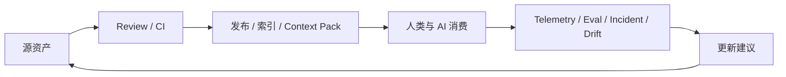

# AI Coding 文档治理原则

## 定位

文档治理原则用于回答这些问题：

| 问题 | 关注点 |
|---|---|
| 哪份文档算数 | SSOT、状态、版本、owner |
| 文档应该放哪里 | 分层、Repo-First、Docs-as-Code |
| 文档由谁负责 | Doc Owner、Domain Owner、Reviewer、AI Maintainer |
| 文档何时失效 | Freshness、review SLA、lifecycle |
| AI 能不能消费 | verified、context policy、retrieval metadata、eval |
| 自动化如何介入 | CI、drift check、schema lint、Context Pack、RAG index |

## 核心原则

| 原则 | 含义 | 最小落地动作 |
|---|---|---|
| 1. SSOT | 每类知识只能有一个主真相源，其他地方只能镜像、编译或摘要 | 为文档标记 `source_of_truth`，禁止多个版本并列为真相 |
| 2. Repo-First | 工程知识默认靠近代码，外部 wiki 主要做协作和消费 | 架构、接口、规范、runbook、agent 规则尽量进 repo |
| 3. Layered Governance | 文档必须按稳定性、用途、消费对象分层，不能混放 | 至少区分元数据层、稳定知识层、变更层、AI 指令层、运行时记忆层、生成视图层 |
| 4. Metadata First | 文档先可识别、可过滤、可追踪，才可治理、可检索 | 统一 frontmatter：`id`、`artifact`、`owners`、`status`、`stability`、`next_review_at` |
| 5. Ownership Mandatory | 没有 owner 的文档不能进入正式知识库 | 每篇文档至少有 `doc_owner`，每个主题有 `domain_owner` |
| 6. Freshness Over Accumulation | 过期文档比缺失文档更危险 | 所有 Active 文档带复审周期和到期提醒 |
| 7. Validate Before Promote | AI 可以草拟，但未经评审不能进入长期知识层 | 进入 `Active` 前必须 review，关键内容必须人工确认 |
| 8. Executable Docs First | 能落到 schema、lint、workflow、IaC 的，不只写 prose | API 用 OpenAPI/Proto，规范尽量落到 lint/config，流程尽量落到 workflow |
| 9. Canonical Once, Adapt Everywhere | 同一套规则只维护一份 canonical，再适配到不同 AI 工具 | 从统一 policy 生成 `AGENTS.md`、`CLAUDE.md`、Copilot instructions 等 |
| 10. Generated Views Are Not Truth | Portal、摘要页、RAG 索引、TechDocs 都只是消费视图 | 明确生成视图只读，不允许在生成视图上手工改真相 |
| 11. Change-Coupled Versioning | 文档版本必须与代码、接口、流程变更联动 | 改 API/schema/关键逻辑时，PR 必须同步更新对应文档 |
| 12. Verified Minimal AI Context | AI 不应消费全部文档，只应消费最小、已验证、未过期上下文 | Context Pack 只纳入 `Active + verified + relevant` 资产 |
| 13. Closed-Loop Governance | 治理不是存档，而是自动检查、评估、漂移发现、事故回写 | CI 做 schema lint、link check、drift check、eval；incident 后回写 runbook / memory / ADR |

## 原则详解

### 1. SSOT

`SSOT` 是横向治理原则，不是一个独立目录或单独文档层。

| 规则 | 说明 |
|---|---|
| 每类事实只能有一个主来源 | 例如 API 真相来自 OpenAPI/Proto，架构决策真相来自 ADR，运行状态真相来自 runtime snapshot |
| 镜像和摘要必须降权 | TechDocs、知识库摘要、RAG chunk、AI 总结都不能覆盖源资产 |
| 元数据必须声明真相来源 | 使用 `source_of_truth: code/manual/generated/external` 之类字段 |

### 2. Repo-First

工程类知识应尽量进入 repo，因为 repo 可以提供版本、review、CI、权限、发布和自动化。

外部 wiki 更适合做协作入口、阅读入口或跨团队消费层。若外部 wiki 与 repo 内容冲突，默认以 repo 中声明的 SSOT 为准。

### 3. Layered Governance

文档不能只按目录分类，还要按稳定性、消费对象和治理方式分层。

| 类型 | 例子 | 治理方式 |
|---|---|---|
| 稳定知识 | 架构原则、术语、ADR | 低频更新，强审核 |
| 变更知识 | PRD、设计方案、release note | 跟随交付节奏，和代码联动 |
| AI 指令 | Prompt、Workflow、Agent Policy | 版本化，配 eval |
| 运行时记忆 | Runbook、Postmortem、Known Issues | 事件驱动更新，定期清理 |
| 生成视图 | TechDocs、RAG index、Context Pack | 自动生成，只读消费 |

### 4. Metadata First

没有元数据的文档无法规模化治理。最低限度应包含：

```yaml
---
id: adr-auth-session-expiry
title: Use sliding session expiry for dashboard access
artifact: adr
domain: auth
service: svc-dashboard-auth
audience: both
stability: stable
status: active
owners:
  doc_owner: team-auth-platform
  domain_owner: architect-identity
review_cycle_days: 180
last_verified_at: 2026-05-20
next_review_at: 2026-11-16
source_of_truth: manual
human_review_required: true
ai_usage:
  include_in_context_pack: true
  retrieval_priority: high
  allow_summary_generation: true
  promote_to_memory: false
---
```

### 5. Ownership Mandatory

角色边界建议如下：

| 角色 | 职责 |
|---|---|
| Doc Owner | 对单篇文档的正确性与 freshness 负责 |
| Domain Owner | 对同一主题下多篇文档的语义一致性负责 |
| Reviewer | 对文档进入正式知识库前的质量负责 |
| AI Maintainer | 对索引、摘要、Context Pack、eval、memory flow 负责 |
| Knowledge Platform Owner | 对 schema、搜索、门户、自动化、指标负责 |

关键规则：没有 owner 的文档不得进入 `Active` 状态。

### 6. Freshness Over Accumulation

文档治理的目标不是文档数量，而是可信知识密度。

每篇关键文档都应有复审周期。到达 `next_review_at` 后，文档应进入 `Needs Refresh`，并从默认 AI 上下文中降权或移除。

### 7. Validate Before Promote

AI 可以生成草稿、摘要、候选记忆和变更建议，但不能直接把这些内容写成长期事实。

进入长期知识库的内容必须经过 owner 或 reviewer 验证。尤其是架构结论、事故根因、合规边界、breaking change 和长期编码规则。

### 8. Executable Docs First

可以机器校验的内容，应优先转成可执行资产。

| 内容 | 推荐载体 |
|---|---|
| API 契约 | OpenAPI / Proto / GraphQL SDL |
| 数据库结构 | migration / schema |
| 编码规范 | lint / formatter / test |
| 发布流程 | workflow / checklist |
| 基础设施 | IaC |
| AI 行为 | prompt / agent policy / workflow manifest |

### 9. Canonical Once, Adapt Everywhere

同一条 AI 工程规则不应分别维护在多个工具中。

推荐维护一份 canonical policy，再编译到不同工具适配层：

| Canonical | Adapter |
|---|---|
| `agents/policies/*.md` | `AGENTS.md` |
| `agents/policies/*.md` | `CLAUDE.md` |
| `agents/policies/*.md` | `.github/copilot-instructions.md` |
| `agents/policies/*.md` | Cursor / Windsurf rules |

### 10. Generated Views Are Not Truth

生成视图可以被阅读、搜索、引用和缓存，但不能被手工编辑为事实源。

| 生成视图 | 真实来源 |
|---|---|
| TechDocs 页面 | repo 中的 Markdown |
| API 参考站点 | OpenAPI / Proto / GraphQL SDL |
| RAG chunk | verified source docs |
| Context Pack | context manifest + source assets |
| AI 摘要页 | 原始文档和元数据 |

### 11. Change-Coupled Versioning

文档版本必须和代码、接口、配置、流程变化联动。

| 变更类型 | 必须同步检查 |
|---|---|
| API/schema 变更 | API contract、changelog、示例、客户端影响 |
| 架构边界变化 | ADR、架构图、服务说明 |
| 运行流程变化 | runbook、workflow、oncall checklist |
| AI 指令变化 | prompt eval、workflow eval、agent behavior regression |
| 事故复盘结论 | runbook、known issues、memory、监控规则 |

### 12. Verified Minimal AI Context

AI 上下文应该按任务编译，而不是全文灌入。

默认只允许这些资产进入 AI 任务上下文：

| 条件 | 要求 |
|---|---|
| 状态 | `status: active` |
| 时效 | 未超过 `next_review_at` |
| 相关性 | domain、service、artifact、risk 匹配 |
| 可信度 | 经过 owner/reviewer 验证 |
| 用途许可 | `ai_usage.include_in_context_pack: true` |

### 13. Closed-Loop Governance

文档治理必须形成闭环。



最小闭环包括：

| 环节 | 自动化 |
|---|---|
| 写入前 | schema lint、frontmatter check、CODEOWNERS |
| 合并前 | link check、API diff、docs-code coupling check |
| 合并后 | TechDocs build、RAG re-index、Context Pack compile |
| 运行中 | freshness scan、dead doc scan、retrieval eval、prompt eval |
| 事件后 | postmortem 回写 runbook、memory、ADR、standards |

## Docs-as-Code 与文档治理的关系

`Docs-as-Code` 是方法，`文档治理` 是制度。

| 维度 | Docs-as-Code | 文档治理 |
|---|---|---|
| 本质 | 工程实践 | 管理体系和运行机制 |
| 核心目标 | 让文档像代码一样可版本化、可评审、可自动化 | 让文档长期可信、可发现、可维护、可被人和 AI 正确消费 |
| 关注点 | Git、PR、Review、CI、Lint、Preview、发布 | SSOT、分层、Owner、生命周期、Freshness、权限、检索、AI 上下文、指标 |
| 解决的问题 | 文档怎么进入工程流程 | 文档怎么成为组织知识基础设施 |
| 常见产物 | Markdown、MkDocs、TechDocs、Docs CI | 元数据规范、owner 机制、复审 SLA、状态流转、drift 检查、Context Pack |

关系可以概括为：

> Docs-as-Code 让文档像代码一样被生产；文档治理让文档像基础设施一样被管理。

## 总纲

文档治理应坚持：

> 单一事实源、Repo 优先、分层管理、元数据先行、Owner 负责、Freshness 驱动、先验证后沉淀、可执行优先、统一策略多端适配、生成视图不作真相、文档与变更联动、AI 最小可信上下文、自动化闭环治理。

