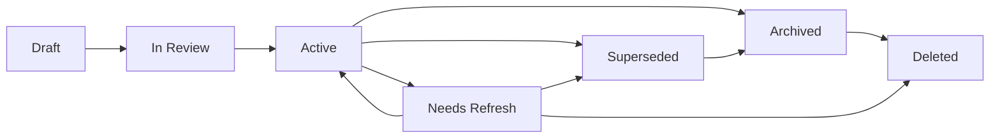
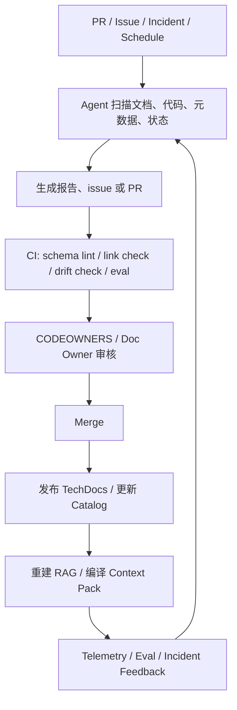

# AI Coding 文档生命周期管理与最佳实践

## 核心结论

AI Coding 场景下，文档生命周期管理的核心不是“定期整理文档”，而是把文档当成一类工程资产来管理：

> 文档真相进 repo，生命周期靠元数据表达，Agent 负责发现和建议，CI 负责阻断，人类 owner 负责确认，AI 只能消费 Active 且未过期的最小可信上下文。

实践上，推荐采用：

```text
Repo-Native Canonical Docs
  + Metadata Schema
  + Lifecycle Agent
  + CI Gate
  + Catalog / TechDocs
  + Context Pack
  + Evals
```

## 生命周期状态机

文档生命周期不应只有“创建”和“更新”，而应明确为一套状态机。



| 状态 | 含义 | AI 是否可默认使用 | 进入条件 | 退出条件 |
|---|---|---|---|---|
| `Draft` | 草稿，尚未审核 | 不可用 | 新建文档、AI 草稿、迁移导入 | 提交 review |
| `In Review` | 正在评审 | 不可用，除非任务明确要求审稿 | PR / MR 打开，owner 被指派 | reviewer 通过或退回 |
| `Active` | 当前可信版本 | 可用 | owner 审核通过，CI 通过，元数据完整 | 到期、漂移、被替代、归档 |
| `Needs Refresh` | 可能过期，需要复审 | 默认不可用或降权 | 到期、漂移、owner 缺失、运行证据冲突 | 重新验证、替代、归档、删除 |
| `Superseded` | 已被新文档替代 | 不可用，只作历史引用 | 新 ADR、新 spec、新规范覆盖旧文档 | 归档 |
| `Archived` | 历史保留，不再指导当前行为 | 不可用 | 服务退役、功能下线、流程废弃 | 删除 |
| `Deleted` | 应彻底移除 | 不可用 | 安全、合规、冗余或错误事实清理 | 无 |

## 失效判定

文档失效不要只看“多久没更新”。更稳的判断是：

```text
失效 = 事实漂移 + 时效过期 + owner 缺失 + 使用风险 + 上下文回归
```

| 失效触发 | 判定规则 | 应进入状态 | Agent 动作 |
|---|---|---|---|
| 时间到期 | 当前日期超过 `next_review_at` | `Needs Refresh` | 开 issue，提醒 owner，移出默认 Context Pack |
| 代码/接口漂移 | 文档描述与代码、API schema、配置、IaC、测试不一致 | `Needs Refresh` | 生成 drift report 或 PR |
| 决策被替代 | 新 ADR、新设计、新规范明确覆盖旧内容 | `Superseded` | 添加 `superseded_by` 链接 |
| owner 缺失 | `doc_owner` 不存在、团队解散、责任人不明确 | `Needs Refresh` | 开 owner assignment issue |
| 运行证据冲突 | incident、告警、oncall 反馈证明 runbook 或假设不成立 | `Needs Refresh` | 生成 runbook/postmortem 更新建议 |
| 产品/服务下线 | 文档绑定的服务、功能、流程已退役 | `Archived` | 归档并从默认索引中移除 |
| 来源不可验证 | 无引用、无 owner、无 review 记录、生成内容未确认 | 不得进入 `Active` | 标记为 draft 或 candidate |
| 安全/合规问题 | 包含敏感信息、错误合规建议、泄露数据 | `Deleted` 或受限归档 | 提交人工审批，删除索引 |
| AI eval 回归 | Prompt、Workflow、Agent instruction 变更后 golden tasks 失败 | `Needs Refresh` | 阻断发布或开修复 PR |

关键规则：

> 只要文档进入 `Needs Refresh`、`Superseded`、`Archived` 或 `Deleted`，就不应该再被 AI 默认消费。

## 不同资产的复审周期

| 文档类型 | 建议复审周期 | 失效敏感度 | 主要失效信号 |
|---|---|---|---|
| ADR | 180-365 天 | 中 | 新 ADR 覆盖、架构边界变化 |
| 架构总览 | 90-180 天 | 高 | 服务拆分、依赖变化、目录结构变化 |
| API Contract | 随代码变更 | 极高 | OpenAPI / Proto / GraphQL diff |
| Product Spec | 30-90 天，或版本结束后归档 | 高 | 需求变更、发布完成、范围调整 |
| System Design | 90-180 天 | 高 | 实现偏离、架构决策变化 |
| Runbook | 30-90 天，incident 后必审 | 极高 | 处置失败、脚本变化、监控字段变化 |
| Postmortem | 结论不频繁改，action items 持续跟踪 | 中 | follow-up 未关闭、根因被新证据推翻 |
| Prompt / Workflow | 模型、工具、规则变更时必审 | 极高 | eval 回归、工具能力变化、上下文规则变化 |
| Memory / Known Issues | 7-30 天 | 高 | 事实被新证据推翻、重复命中下降 |

## 最小元数据 Schema

每篇正式文档都应具备生命周期元数据。

```yaml
---
id: runbook-api-rate-limit
title: API rate limit runbook
artifact: runbook
status: active
domain: platform
service: svc-api-gateway
audience: both
stability: dynamic
risk: p1
phase: operate
source_of_truth: manual
owners:
  doc_owner: team-platform
  domain_owner: platform-architecture
reviewers:
  - team-sre
review_cycle_days: 90
last_verified_at: 2026-05-27
next_review_at: 2026-08-25
human_review_required: true
related_code:
  - services/gateway/rate-limit.ts
contracts:
  - apis/openapi/gateway.yaml
supersedes:
superseded_by:
ai_usage:
  include_in_context_pack: true
  retrieval_priority: high
  require_active_status: true
  allow_summary_generation: true
  promote_to_memory: false
---
```

最低要求字段：

| 字段 | 目的 |
|---|---|
| `id` | 稳定标识 |
| `artifact` | 文档类型 |
| `status` | 生命周期状态 |
| `owners.doc_owner` | 单篇文档责任人 |
| `owners.domain_owner` | 主题一致性责任人 |
| `source_of_truth` | 真相来源 |
| `last_verified_at` | 最近验证时间 |
| `next_review_at` | 下次复审时间 |
| `ai_usage` | 是否允许进入 AI 上下文 |

## Agent 协作模型

实践中不要让一个通用 Agent 负责全部生命周期。更合理的是把职责拆给多个专职 Agent。

| Agent | 职责 | 产物 | 人工门禁 |
|---|---|---|---|
| `Doc Intake Agent` | 从 issue、PRD、设计讨论、incident 生成文档草稿 | Draft PR | PM / Tech Lead 确认范围 |
| `Metadata Agent` | 补 owner、status、source_of_truth、review date、code refs | metadata patch | schema lint + reviewer |
| `Drift Agent` | 比较代码、API、配置、runbook 与文档描述 | drift report / PR | owner 判断是否真实漂移 |
| `Freshness Agent` | 定时扫描过期文档、owner 缺失、死链接 | issue / status patch | owner 重新验证 |
| `Review Agent` | 生成文档 PR review checklist 和风险摘要 | review comment | CODEOWNERS 审核 |
| `Context Pack Agent` | 编译最小可信上下文 | context pack manifest | CI 校验状态和时效 |
| `Memory Curator Agent` | 从 incident 和重复问题中整理候选 memory | memory candidate | 人工决定是否晋升 |
| `Eval Agent` | 跑 prompt、workflow、retrieval、agent 行为回归 | eval report | 低于阈值阻断发布 |

边界原则：

| Agent 可以做 | Agent 不应单独做 |
|---|---|
| 生成草稿 | 标记文档为 `Active` |
| 补元数据建议 | 删除文档 |
| 发现漂移 | 判定事故根因 |
| 开 issue / PR | 确认架构决策 |
| 生成 review checklist | 晋升长期 memory |
| 编译 Context Pack | 覆盖 SSOT |

## 生命周期自动化流程



## 触发机制

| 触发源 | Agent 动作 |
|---|---|
| PR 打开或更新 | 分析 affected docs，检查是否需要同步文档 |
| PR 合并 | 发布文档，更新索引，编译 Context Pack |
| Nightly schedule | 扫描 freshness、dead links、owner、dead docs |
| API schema 变更 | 触发 API 文档、changelog、示例同步检查 |
| Incident 关闭 | 生成 postmortem 草稿，检查 runbook 和 memory 是否需要更新 |
| 模型升级 | 跑 prompt/workflow eval，标记失败资产 |
| 工具权限变化 | 跑 agent workflow eval，检查 MCP/tool-use 行为 |
| 服务退役 | 标记相关文档为 `Archived` candidate |

## CI 门禁

推荐在 CI 中至少做这些检查。

| 检查 | 阻断条件 |
|---|---|
| frontmatter schema lint | 缺少 `id/status/owner/source_of_truth/next_review_at` |
| status transition check | 非法状态跳转，例如 `Draft -> Active` 跳过 review |
| CODEOWNERS check | 缺少对应 owner approval |
| link check | 链接或 anchor 失效 |
| code refs check | `related_code` 指向不存在路径 |
| doc-code coupling check | 改 API/schema/关键逻辑但无文档更新或豁免说明 |
| OpenAPI / Proto diff | breaking change 未更新 changelog |
| Context Pack eligibility check | 非 `Active` 文档进入默认 Context Pack |
| prompt/workflow eval | golden tasks 低于基线 |
| retrieval eval | P@K 或引用准确率低于阈值 |

## AI Context 准入规则

Context Pack 编译应采用硬规则。

```text
include only:
status == active
next_review_at >= today
owner exists
ai_usage.include_in_context_pack == true
domain/service/risk matches current task
```

必须排除：

```text
Draft
In Review
Needs Refresh
Superseded
Archived
Deleted
无 owner
无 source_of_truth
过期未复审
未通过 eval 的 prompt/workflow
```

## 事故后的强制回写

事故结束后，Agent 应自动检查这些回写动作。

| 事故产物 | 可能回写位置 |
|---|---|
| 时间线 | `postmortems/` |
| 处置步骤变化 | `runbooks/` |
| 根因涉及架构决策 | `adr/` |
| 重复故障模式 | `memory/known-issues/` |
| 监控缺失 | observability docs |
| 流程缺陷 | `workflows/` |
| AI 没找到正确文档 | retrieval eval / Context Pack manifest |
| Prompt 指引错误 | `prompts/` / `agents/policies/` |

关键判断：

> 事故如果没有回写，文档治理就是断环。

## Prompt / Workflow 的生命周期

Prompt、Workflow、Agent Instructions 属于可执行文档，应按代码资产治理。

| 变更 | 必跑检查 |
|---|---|
| 改 prompt | golden task eval |
| 改 workflow | end-to-end agent eval |
| 换模型 | regression eval |
| 改工具权限 | tool-use eval |
| 改 Context Pack 规则 | retrieval eval |
| 改 agent policy | behavior compliance eval |

没有 eval 的 prompt 只能算经验文本，不应视为可治理资产。

## 最佳实践清单

| 实践 | 说明 |
|---|---|
| 文档真相进 repo | 使用 Git、PR、review、CI 管理文档 |
| 外部 wiki 只做消费层 | 不让外部页面覆盖 repo SSOT |
| 每篇文档都有 owner | 没有 owner 不得进入 `Active` |
| 每篇文档都有失效日期 | 使用 `next_review_at` 触发复审 |
| Agent 只提议不定稿 | Agent 输出 issue、PR、report，不直接确认事实 |
| 状态变更走 CI | 生命周期状态跳转需要 schema 和权限检查 |
| 生成视图只读 | TechDocs、RAG、摘要页、Context Pack 不作为真相源 |
| AI 只吃 Active 文档 | 过期、归档、被替代文档不得默认进入上下文 |
| Prompt/Workflow 配 eval | 指令资产必须有回归测试 |
| Incident 必须回写 | postmortem 后更新 runbook、memory、ADR 或 workflow |
| Supersede 不覆盖历史 | ADR 和重大设计保留决策链 |
| 用指标治理质量 | freshness、drift、retrieval、eval、owner 完整率都要可观测 |

## 指标体系

| 指标 | 定义 | 目标 |
|---|---|---|
| Owner 完整率 | 带 `doc_owner` 和 `domain_owner` 的文档占比 | 100% |
| Active freshness 达成率 | Active 文档在 SLA 内复审的比例 | > 90% |
| 过期文档进入 Context Pack 数量 | 过期文档被 AI 默认消费的次数 | 0 |
| Doc-Change 联动率 | 涉及代码/API 变更且同步更新文档的 PR 占比 | > 80% |
| Drift Backlog | 已发现但未修复的文档漂移数量 | 持续下降 |
| Dead Doc Ratio | 无 owner、无引用、低访问的文档占比 | < 10% |
| Retrieval Precision@K | 检索前 K 条中真正相关文档比例 | > 0.8 |
| Prompt Regression Score | prompt/workflow 升级后 golden tasks 通过率 | 不低于基线 |
| Postmortem Closure Rate | 事故 action items 按期关闭比例 | > 85% |
| Review Lead Time | 文档从 Draft 到 Active 的中位时长 | 逐季降低 |

## 落地路线

| 阶段 | 目标 | 必做项 |
|---|---|---|
| 第 1 阶段：骨架 | 让文档可治理 | 目录结构、frontmatter schema、状态机、owner 字段 |
| 第 2 阶段：门禁 | 让文档变更可控 | CI lint、CODEOWNERS、link check、status transition check |
| 第 3 阶段：自动发现 | 让失效可见 | freshness agent、drift agent、dead doc scan |
| 第 4 阶段：AI 消费 | 让 AI 只吃可信上下文 | Context Pack、RAG metadata filter、Active-only indexing |
| 第 5 阶段：闭环 | 让文档持续变好 | incident 回写、prompt eval、retrieval eval、治理指标看板 |

## 参考实践来源

| 方向 | 参考 |
|---|---|
| Repo-native AI instructions | GitHub Copilot repository custom instructions、path-specific instructions、prompt files、agent instructions |
| AI code review | GitHub Copilot code review custom instructions |
| Agent 分工与上下文隔离 | Claude Code subagents |
| 自动化触发 | Claude Code hooks、GitHub Actions scheduled workflows |
| 人工门禁 | GitHub CODEOWNERS、protected branches、required status checks |
| Catalog 与 owner | Backstage Software Catalog、TechDocs |
| Freshness | Notion verified pages、owner、expiration |
| RAG 过滤 | OpenAI vector store search attributes / filters |
| Prompt / Agent 可靠性 | OpenAI Evals、Claude Evaluation Tool |

## 一句话总结

文档生命周期管理的最佳实践是：

> 让 Agent 负责发现、生成、提醒、编译和验证；让元数据和 CI 负责约束；让 owner 负责最终真相；让 AI 只消费 Active、未过期、可追溯的最小上下文。

