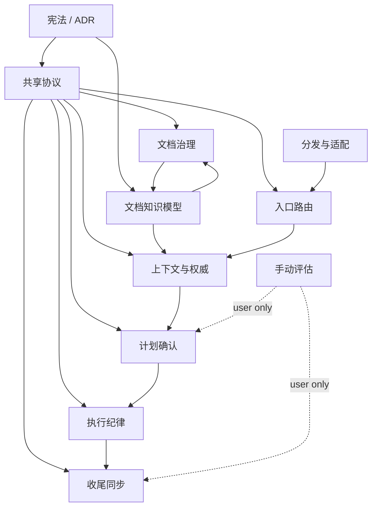

# Architecture Module Design

本文定义 Doc Loom Least 当前阶段的模块划分、职责边界和模块间协作方式。

权威边界：

- 本文是架构设计草案，不是 L1 authority。
- `docs/adr/ADR-0000-constitution.md` 高于本文。
- `docs/adr/ADR-0001-lifecycle-scope-and-skill-grouping.md` 拥有生命周期范围和 skill 分组事实。
- 具体运行行为以各 `SKILL.md` 和 `skills/_shared/references/shared-protocol.md` 为准。
- 若本文与宪法、ADR、当前 skill 文件冲突，应修改本文。

## 设计定位

Doc Loom Least 的架构模块不是后端服务模块，也不是 CLI pipeline 模块。

当前系统是一套 repo-native、skill-based、Markdown-first 的个人工作流承接层。模块边界应优先沿着以下对象切分：

- skill 职责边界；
- Markdown artifact 所有权；
- authority / operational / derived / historical / scratch 文档层级；
- 用户确认 gate；
- 可跨会话恢复的最小状态。

这意味着模块之间通过文档、共享协议和显式确认协作，而不是通过后台进程、数据库、RPC 或中心编排器协作。

## 模块总览

| 模块 | 主要路径 | 核心职责 | 非职责 |
|---|---|---|---|
| 宪法与协议内核 | `docs/adr/*`, `skills/_shared/references/shared-protocol.md` | 定义不可违反原则、权威顺序、artifact policy、case 状态规则和跨 skill 约束 | 不执行任务，不替代阶段 skill |
| 文档知识模型 | `docs/index.md`, `docs/ssot-map.md`, `docs/authority/**`, `docs/cases/**`, `docs/reference/**` | 承载事实分层、文档路由、证据与权威关系 | 不把历史材料自动当作当前事实 |
| 入口路由模块 | `skills/development/docloom-workflow/` | 解析用户意图、workspace 和 case 状态，延迟创建 case，路由到正确 skill | 不生成计划，不执行代码，不触发 review |
| 上下文与权威模块 | `skills/development/context-authority/` | 读取最小相关上下文，判断事实权威和冲突，输出 route verdict | 不创建 case，不写计划，不解决 owner 冲突 |
| 计划确认模块 | `skills/development/plan-confirm/` | 生成带版本、风险、TDD 策略、验收标准和确认日志的计划 | 未确认计划不得进入执行 |
| 执行纪律模块 | `skills/development/tdd-execute/` | 按已确认计划执行 TDD 或记录例外，维护执行证据和 `review_risk` | 不修改 authority，不越过计划非目标 |
| 收尾同步模块 | `skills/development/doc-sync-close/` | 判断 closure status，同步 L2/L3 文档，记录验收、风险、后续和 authority proposal | 不通过修改代码或计划语义来让 closure 通过 |
| 文档治理模块 | `skills/governance/setup-doc-governance/` | 扫描文档、抽取事实、生成治理计划，经确认后 promote / merge / bridge / archive / block | 不修改代码、测试、构建脚本或运行行为 |
| 手动评估模块 | `skills/assessment/review/`, `skills/assessment/grill/` | 显式触发的只读审查和交互式压力测试 | 不写文件，不改状态，不路由 workflow |
| 分发与适配模块 | `skills/README.md`, `INSTALL.md`, `AGENTS.md`, `CLAUDE.md` | 保持 skill 分组、安装、同步和 agent 指令入口可发现 | 不持有运行事实，不复制完整协议 |

## 模块职责

### 1. 宪法与协议内核

该模块提供整个系统的不可违反边界。

职责：

- 定义三条宪法原则：最小路径、不成为复杂流水线、人类语义优先。
- 定义 Execution Instruction Order 和 Fact Authority Order。
- 定义 High-Risk Topics、case identity、run mode、closure status、artifact policy。
- 定义不同 skill 的所有权，防止一个入口模块退化成全能 orchestrator。

输入：

- owner 已接受的 ADR；
- 当前 shared protocol；
- 明确的用户修宪或流程变更决策。

输出：

- 可被各 skill 引用的全局约束；
- 判断文档冲突和权威优先级的规则。

边界：

- 不保存任务详细证据。
- 不创建新的流程阶段。
- 不因为某个任务复杂就放宽确认 gate。

### 2. 文档知识模型

该模块定义“事实放在哪里、谁能覆盖谁”。

职责：

- 路由当前文档入口：`docs/index.md`。
- 维护事实来源地图：`docs/ssot-map.md`。
- 承载 ADR、设计文档、reference、未来 authority 和 case artifacts。
- 区分 L1 authority、L2 operational、L3 derived、L4 historical、L5 scratch。

关键规则：

- 历史文档是证据，不是当前权威。
- `case_state.yaml` 是状态缓存，不是事实真相。
- 设计草案可以指导讨论，但不能覆盖 active authority、代码、测试或已接受 ADR。

边界：

- 不自动把设计文档升级为 authority。
- 不为了完整目录结构创建空 authority section。

### 3. 入口路由模块

`docloom-workflow` 是 public entry 和 thin router。

职责：

- 读取最小 git / workspace / case 状态。
- 判断任务是 status-only、governance、context gate、plan、execute 还是 close。
- 只在需要持久 case 时创建最小 case identity。
- 持有 Artifact Policy，决定哪些 artifact 按条件需要。
- 支持 fast-path，但不取消确认语义。

输入：

- 用户当前意图；
- git 状态；
- 已有 case docs；
- `context-authority` 的 verdict。

输出：

- route decision；
- 必要时的 `case_state.yaml` 初始状态；
- 下一个 owning skill。

边界：

- 不写实现计划。
- 不执行代码或文档治理。
- 不自动触发 `review` 或 `grill`。

### 4. 上下文与权威模块

`context-authority` 是计划前的上下文 gate。

职责：

- 按任务意图读取最小相关上下文。
- 判断 authority、代码、测试、ADR、case docs 之间是否冲突。
- 记录包含和排除的来源及理由。
- 输出 `proceed_to_plan`、`proceed_to_plan_with_risk`、`needs_user_decision`、`needs_case_selection`、`run_setup_doc_governance` 或 `blocked_by_authority_conflict`。

输入：

- 用户目标；
- authority / ADR / SSOT / shared protocol；
- 必要时的代码、测试、case docs。

输出：

- inline context summary；
- 高风险、冲突、恢复或跨会话场景下的 `context-authority-brief.md`。

边界：

- 不创建 case id。
- 不写执行计划。
- 不擅自解决 owner 冲突。

### 5. 计划确认模块

`plan-confirm` 把“要做什么”变成可确认对象。

职责：

- 生成 `plan.md`。
- 绑定 `plan_version`、`risk_level`、`base_commit`、TDD 策略和验收标准。
- 记录用户已确认的执行约束。
- 将计划状态从 `draft` 推进到 `approved`。

输入：

- case identity；
- context summary 或明确的 low-risk skipped-context reason；
- workspace baseline；
- authority / ADR / 相关设计约束；
- 用户确认的讨论决策。

输出：

- draft 或 approved `plan.md`；
- `case_state.yaml` phase 更新；
- 有恢复点时的 `handoff.md`。

边界：

- 没有 context 或明确跳过理由，不写计划。
- 没有 case identity，不写 case plan。
- 没有当前版本确认，不进入执行。

### 6. 执行纪律模块

`tdd-execute` 只执行已确认的持久 case 计划。

职责：

- preflight 检查计划、确认日志、base commit 和 workspace drift。
- 按 Red / Green / Refactor 执行，或执行已确认的 TDD exception。
- 写入必要的 `execution.md`。
- 维护 plan checkbox、Plan Amendments、acceptance evidence 和 `review_risk`。
- 执行完成后把 case 推进到 `doc_syncing`。

输入：

- approved `plan.md`；
- `case_state.yaml`；
- 相关代码、测试、命令和项目包管理约束。

输出：

- 代码或文档变更；
- 测试和验证证据；
- `execution.md`；
- `review_risk` 信号。

边界：

- 不执行未确认计划。
- 不修改 authority docs。
- 不越过非目标、public contract、配置、依赖或迁移边界。
- 默认不 stage 或 commit，除非计划或用户明确要求。

### 7. 收尾同步模块

`doc-sync-close` 负责把任务结果写成可恢复、可审计的结束状态。

职责：

- 根据验收证据选择 closure status。
- 逐项映射 acceptance criteria：`met`、`partially_met`、`not_met`、`not_verified`、`out_of_scope`。
- 汇总代码变更、测试、未运行检查、风险、后续。
- 同步 L2 operational docs 和安全的 L3 derived docs。
- 对 authority 变化写 proposal，或在明确窄 patch 确认后执行。
- 写 `closure.md` 并关闭 `case_state.yaml`。

输入：

- `plan.md`；
- `execution.md` 或 closure 内联证据；
- 当前 diff；
- review findings；
- 相关 authority / L3 docs；
- `review_risk`。

输出：

- `closure.md`；
- closed `case_state.yaml`；
- 必要时的 `handoff.md`、authority proposal 或治理 follow-up。

边界：

- 未满足验收不能标 `Done`。
- 不修改代码、测试、依赖或计划语义来让 closure 通过。
- 结构性或高风险 authority 变更必须进入治理计划。

### 8. 文档治理模块

`setup-doc-governance` 负责把散落材料治理成可确认的权威体系。

职责：

- 选择 scope：`current-case`、`docs-only`、`full-repo`。
- 盘点 docs、README、ADR、入口索引、历史材料，必要时读取代码和测试作为只读证据。
- 抽取 facts，并给文件级和事实级 decision 下 verdict。
- 写治理计划，经用户一次确认后应用非 blocked 决策。
- 按需创建 `docs/authority/**`，并保持旧入口桥接或归档。

输入：

- 治理范围；
- 当前 docs 和历史材料；
- authority / ADR / shared protocol；
- 必要时的代码和测试证据。

输出：

- `docs/governance/YYYY-MM-DD-<slug>.md` 或 case 绑定的 `governance-plan.md`；
- 按确认执行后的 authority、bridge、archive、index 更新。

边界：

- 不写入未确认事实到 authority。
- 不修改代码、测试、构建脚本或运行行为。
- 不把新的独立治理批次写入旧 plan 文件。

### 9. 手动评估模块

`review` 和 `grill` 是对话级辅助，不属于主 workflow 阶段。

职责：

- `review`：对设计、diff、测试、文档变更或 case evidence 做只读证据审查。
- `grill`：逐问压力测试一个主张、需求、计划或架构判断。
- 输出 findings、evidence gaps、确认过的讨论选择或风险提示。

输入：

- 用户明确指定的 review / grill 对象；
- 最小相关证据。

输出：

- 对话内审查结论或问题树。

边界：

- 不写文件。
- 不更新 `case_state.yaml`。
- 不输出 workflow route。
- 不把短回答自动升级成长久 authority 决策。

### 10. 分发与适配模块

该模块让 Doc Loom Least 能作为 skills 集合进入不同 agent 环境。

职责：

- 保持 `skills/` 物理分组与 frontmatter `name` 稳定。
- 维护安装和同步入口。
- 让 `AGENTS.md`、`CLAUDE.md` 等 agent 指令只保留薄摘要和项目约束。
- 支持 skillshare 发现和同步。

输入：

- canonical skill files；
- 安装说明；
- 项目本地 agent 指令约束。

输出：

- 可安装、可同步、可被 agent 调用的 skill 树。

边界：

- 不复制完整 workflow 规则到每个 agent 指令文件。
- 不让适配层成为新的事实源。

## 依赖方向

模块依赖应保持单向、窄接口：



依赖规则：

- 阶段 skill 可以读取 shared protocol，不能重写 shared protocol。
- 入口模块可以路由到阶段 skill，不能替代阶段 skill。
- 手动评估只能通过用户提供的结论被后续 skill 消费。
- 治理模块可以更新知识模型，但必须经治理计划或明确窄 patch 确认。
- 分发适配只能传播 canonical skill，不拥有事实。

## Artifact 所有权

| Artifact / 事实 | Owner 模块 | 说明 |
|---|---|---|
| 宪法原则 | 宪法与协议内核 | 修改需要 explicit owner decision |
| 生命周期范围和 skill 分组 | 宪法与协议内核 | 当前由 ADR-0001 持有 |
| Fact Authority Order | 宪法与协议内核 | shared protocol 为运行规则 |
| `case_state.yaml` 初始创建 | 入口路由模块 | 只是状态缓存 |
| `context-authority-brief.md` | 上下文与权威模块 | 仅在高风险、冲突、恢复等场景持久化 |
| `plan.md` | 计划确认模块 | 计划确认对象 |
| `execution.md` | 执行纪律模块 | TDD、验证、偏离和执行证据 |
| `closure.md` | 收尾同步模块 | case 结束事实记录 |
| `handoff.md` | 当前阶段 skill | 只在有未来恢复点时创建 |
| governance plan | 文档治理模块 | 每个独立治理批次一个 plan |
| `docs/authority/**` | 文档治理模块 / 收尾同步模块 | 只能写入确认事实 |
| `docs/index.md` | 文档知识模型 | 路由索引，不覆盖上游事实 |
| review / grill 输出 | 手动评估模块 | 对话证据，不是 workflow 状态 |

## 典型流转

### 低风险一次性文档修改

```text
用户请求
  -> 读取宪法 / 相关设计
  -> 修改目标文档
  -> 简单验证
```

不创建 case，不写 plan，不写 closure。

### 持久化开发 case

```text
docloom-workflow
  -> context-authority
  -> plan-confirm
  -> 用户确认 plan_version
  -> tdd-execute
  -> doc-sync-close
```

适用于需要跨会话、TDD 证据、验收记录或高风险确认的开发任务。

### 文档治理

```text
setup-doc-governance
  -> 选择 scope
  -> 盘点与抽取事实
  -> 写 governance plan
  -> 用户确认
  -> 应用非 blocked 决策
  -> 写回 applied result
```

适用于 authority 重建、历史文档归档、索引修复、冲突事实处理。

### 手动审查或压力测试

```text
用户明确请求 review / grill
  -> 读取最小证据
  -> 输出对话结果
  -> 后续 skill 仅在用户提供或确认后消费结果
```

不进入主 workflow，不自动生成 artifact。

## 当前不应新增的模块

以下模块当前不应创建：

- CLI backend 模块；
- daemon / worker 模块；
- 全局任务数据库模块；
- 自动 review dispatcher；
- 空的 `product/`、`research/`、`design/`、`release/`、`operations/` 生命周期目录；
- 独立 orchestration engine；
- 为了“架构完整”而存在的 placeholder artifact。

这些都违反或削弱当前宪法中的最小路径和不成为复杂流水线原则。

## 未来扩展边界

未来可以扩展，但必须满足真实边界：

| 扩展方向 | 进入条件 | 形式 |
|---|---|---|
| 产品、调研、设计等生命周期域 | 出现稳定、重复、可命名的工作流边界 | 新增真实 skill 分组，而不是空目录 |
| 更强 authority 体系 | 已有设计或 case 事实需要长期复用并经确认 | `docs/authority/**` 按需创建 |
| 可机器校验 contract | 出现 API、schema、配置或迁移契约 | 用 OpenAPI、migration、lint 或测试承载 |
| 多 agent 适配 | 多工具分发出现漂移成本 | canonical source + 派生适配层 |

扩展必须先证明它解决了真实治理失败，而不是补齐路线图。

## 待确认问题

- 本文是否需要在后续用户确认后晋升为 architecture authority，还是长期停留在 `docs/design/`。
- 是否需要把“文档知识模型”拆成单独设计文档，专门描述 L1-L5 文档层和 index/SSOT 关系。
- 未来产品/调研/设计生命周期出现时，是复用当前 case workflow，还是为各领域定义更窄的 skill contract。
