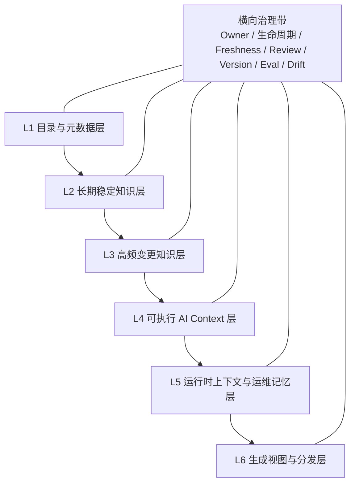

# AI Coding 文档治理分层模型

## 定位

AI Coding 场景下，文档治理的目标不是单纯“把知识写下来”，而是把工程知识组织成模型可稳定消费、团队可持续维护、自动化系统可验证执行的上下文基础设施。

因此，文档体系需要同时满足四类消费：

| 消费对象 | 需要什么 |
|---|---|
| 人类 | 可读、可信、可追溯的知识 |
| 工程系统 | 可校验、可发布、可版本化的源资产 |
| AI / Agent | 最小、相关、已验证的上下文 |
| 治理系统 | owner、状态、时效、风险、引用关系和质量指标 |

## 总体模型

推荐采用 `6 层 + 1 条横向治理带`。



## 分层定义

| 层级 | 目标 | 典型资产 | 稳定性 | 推荐载体 | 维护主责 |
|---|---|---|---|---|---|
| L1 目录与元数据层 | 定义拥有权、可发现性、可过滤性 | `catalog-info.yaml`、frontmatter、owner、tags、review SLA | 稳定 | YAML / JSON / Markdown frontmatter | 平台团队 + Domain Owner |
| L2 长期稳定知识层 | 保存长期不会频繁变化的认知骨架 | 架构原则、coding standards、术语表、服务边界、ADR log | 低频变更 | Markdown + diagrams-as-code | 架构 owner / 平台 owner |
| L3 高频变更知识层 | 支撑产品交付与变更管理 | Product Spec、System Design、Release Note、Changelog、API 变更说明 | 高频 | Markdown + structured frontmatter | PM / Tech Lead / Service Owner |
| L4 可执行 AI Context 层 | 直接驱动 AI 行为 | Prompt、Agent Instructions、Workflow、技能说明、任务模板 | 高频且需要控变 | Markdown、YAML frontmatter、JSON manifest | AI Maintainer + Domain Owner |
| L5 运行时上下文与运维记忆层 | 面向 incident、运行状态与经验反馈 | Runbook、Postmortem、Known Issues、Runtime Snapshot、Memory | 实时或事件驱动 | Markdown + JSON snapshots | SRE / Oncall / Service Owner |
| L6 生成视图与分发层 | 把源资产编译成可消费视图 | TechDocs、API 参考站点、Context Pack、RAG 索引、摘要页 | 自动生成 | HTML / JSON / embedding index | 平台自动化 |

## 每层职责边界

| 层级 | 应该做 | 不应该做 |
|---|---|---|
| L1 目录与元数据层 | 标记 owner、状态、风险、时效、AI 使用策略 | 承载长篇设计论证 |
| L2 长期稳定知识层 | 沉淀架构原则、术语、决策、长期规范 | 放置每天变化的计划和临时记录 |
| L3 高频变更知识层 | 管理需求、方案、发布、迁移和变更记录 | 替代长期架构真相 |
| L4 可执行 AI Context 层 | 管理 AI 指令、prompt、workflow、agent policy | 手工复制多套工具规则导致漂移 |
| L5 运行时上下文与运维记忆层 | 记录运行状态、事故经验、已知问题和操作手册 | 把未验证的临时经验直接晋升为长期规范 |
| L6 生成视图与分发层 | 生成门户、索引、摘要、Context Pack、API 参考 | 作为人工编辑的事实源 |

## SSOT 在模型中的位置

`SSOT` 不是单独一层，而是一条横向治理原则。

| 位置 | 作用 |
|---|---|
| L1 | 声明“谁是 SSOT”，例如 `source_of_truth: code/manual/generated/external` |
| L2-L5 | 承载不同类型知识的真实来源 |
| L6 | 只做展示、分发、检索和编译产物，不作为 SSOT |

不同资产的 SSOT 通常如下：

| 知识类型 | SSOT 所在层 |
|---|---|
| 架构原则、术语、长期编码规范 | L2 长期稳定知识层 |
| 产品需求、系统设计、变更说明、release note | L3 高频变更知识层 |
| Agent 规则、Prompt、Workflow | L4 可执行 AI Context 层 |
| Runbook、Postmortem、Known Issues、Runtime Snapshot | L5 运行时上下文与运维记忆层 |
| TechDocs、摘要页、RAG 索引、Context Pack | L6 生成视图与分发层，仅作为消费视图 |

## AI 上下文供给模型

AI 不应默认消费全部文档，而应通过分层编译拿到最小可信上下文。

| 优先级 | 上下文类型 | 典型来源 |
|---|---|---|
| 1 | 组织级策略 | 安全、合规、通用工程规范 |
| 2 | Repo 全局上下文 | `AGENTS.md`、`CLAUDE.md`、`.github/copilot-instructions.md` |
| 3 | 路径级上下文 | 目录级规则、子域规范、path-specific instructions |
| 4 | 任务级上下文 | 当前 issue、spec、PR、workflow、agent profile |
| 5 | 检索上下文 | 相关 ADR、API、runbook、domain docs |
| 6 | 运行时上下文 | CI 结果、日志、告警、feature flags、部署状态 |
| 7 | 会话与记忆 | compacted state、上一轮结论、候选 memory |

## Context Pack

`Context Pack` 是面向 AI 任务编译出来的最小上下文包，应该由静态策略、任务增量、运行证据和输出契约组成。

```yaml
task:
  id: pr-review-checkout-4821
  objective: review
  risk: p1
policy_pack:
  - docs/standards/review-guidelines.md
  - docs/standards/security-baseline.md
repo_pack:
  - docs/architecture/checkout-overview.md
  - apis/openapi/checkout.yaml
delta_pack:
  - specs/changes/checkout-refund-retry.md
  - adr/ADR-0042-use-idempotency-window.md
evidence_pack:
  - ci/test-failures.json
  - observability/error-snapshot.json
memory_pack:
  - memory/known-issues/refund-duplicate-charge.md
output_contract:
  must_update:
    - runbooks/refund-retry.md
  must_not_change:
    - apis/openapi/auth.yaml
```

## Repo 结构参考

```text
/
├─ catalog-info.yaml
├─ mkdocs.yml
├─ AGENTS.md
├─ CLAUDE.md
├─ docs/
│  ├─ architecture/
│  ├─ standards/
│  ├─ glossary/
│  ├─ domains/
│  └─ onboarding/
├─ specs/
│  ├─ product/
│  ├─ system/
│  └─ changes/
├─ adr/
├─ apis/
│  ├─ openapi/
│  ├─ graphql/
│  ├─ protobuf/
│  └─ examples/
├─ runbooks/
├─ postmortems/
├─ prompts/
├─ workflows/
├─ agents/
│  ├─ profiles/
│  ├─ policies/
│  └─ adapters/
├─ context/
│  ├─ manifests/
│  ├─ packs/
│  └─ snapshots/
└─ memory/
   ├─ lessons/
   ├─ known-issues/
   └─ decisions/
```

## 模型总结

这套分层模型的核心判断是：

| 判断 | 说明 |
|---|---|
| 源资产优先 | 真相应保存在可版本化、可 review、可追踪的源文件中 |
| 生成视图降权 | 门户、摘要、索引和 RAG 都是消费层，不是事实源 |
| AI 上下文需编译 | AI 默认只能消费最小、相关、已验证、未过期的上下文 |
| 治理横贯所有层 | owner、生命周期、freshness、review、version、eval、drift 不能只作用于某一类文档 |

