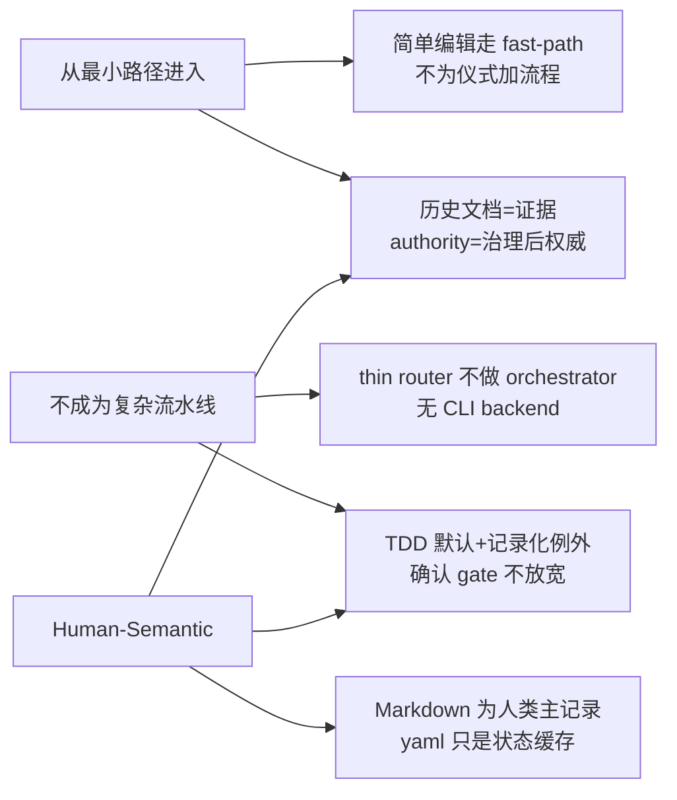
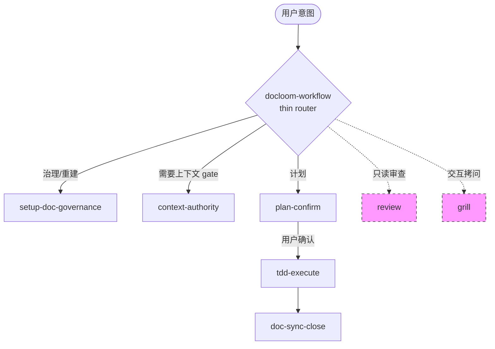
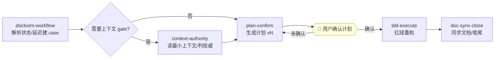
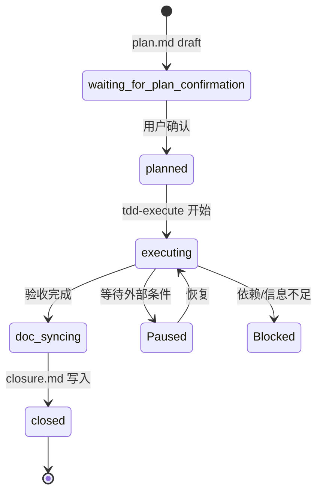
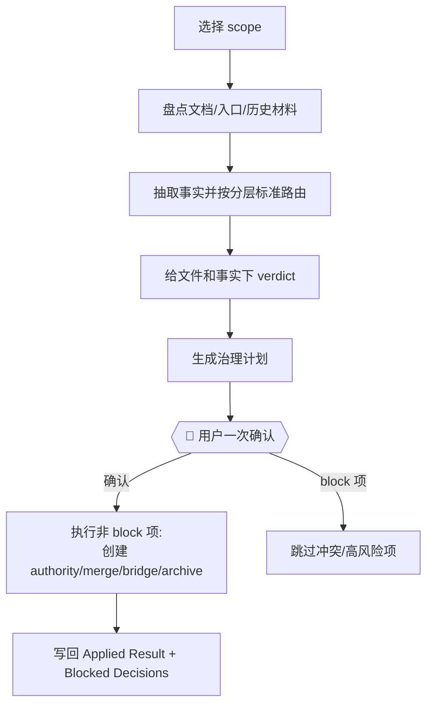

# 文档驱动的个人产品工作流：当前开发流

> 一套用 Skills + Markdown 搭起来的最小工作流，让 AI agent 和你始终对齐三件事：
> **该信什么事实、该改什么文档、哪些决策要先确认。**

这不是某一个项目的使用说明，而是一套可以独立理解、迁移到任何仓库的工作流与设计理念。当前实现只聚焦开发流；长期上，它可以作为个人产品工作流的承接层，继续接入产品、调研、设计、发布、运营等生命周期内容。

这里的“承接层”仍然是 repo-native、skill-based、Markdown-first 的轻量系统：不是 CLI 后端，不是应用平台，也不是重型流水线。下面讲清楚它在开发流中的原理、原则和角色划分——你可以照着这套理念设计自己的实现，也可以直接复用下文描述的 skill 角色。

---

## 1. 要解决什么问题

AI agent 很强，但在开发任务中有三类通病，几乎人人都踩过：

- **上下文漂移**：聊着聊着就忘了当前事实到底是什么，把过时的旧文档当成权威照着改。
- **跳过确认**：面对高风险改动（权限、计费、数据删除、public API）直接动手，没有人为 gate。
- **无痕迹**：做完了不留记录，下次接续任务时谁也说不清"上一步到哪、为什么这么干"。

这套工作流不打算用重型平台解决这三件事。它的开发流定位很明确：

> **不是 CLI，不是流水线产品，而是一组在对话里就能驱动的角色（skill）+ 轻量 Markdown 产物。**

机制越小越好——只在关键节点（计划、执行、收尾）设 gate，再加一套共享协议让事实、任务状态和产物在跨会话间保持一致。

---

## 2. 设计理念

三条宪法原则，不可违反：

| 原则 | 含义 |
|---|---|
| **从最小路径进入** | 用最窄的契约、产物或 skill 解决真实问题，不为仪式感加流程 |
| **不成为复杂流水线** | 它是工作流不是产品，没有 CLI 后端、没有重型编排 |
| **Human-Semantic 设计** | 每份文档、prompt、输出都要可读、易懂、美观，意义优先于机械 |

从这三条延伸出几条贯穿全局的态度，理解了它们就理解了所有具体规则为什么这么定：

- **历史文档是证据，不是权威**。旧需求、旧设计、会议记录默认不能当当前事实用——它们是抽取事实的原材料。
- **过期文档比缺失文档更危险**。一份看着像权威、实则已与代码脱节的文档，会把 agent 引向错误实现；没有文档时 agent 至少会去读代码或发问。所以治理的目标是**可信知识密度**，不是文档数量——过期的就该降级或归档。
- **确认 gate 不被普通文档放宽**。低风险改动也要用户确认，不支持 auto execution。
- **TDD 是默认纪律，但允许记录化例外**。纯文档、配置、spike、hotfix 不会被流程卡死，但必须记录替代验证方式。
- **不比它所治理的改动更大**。简单文档编辑走最小路径，只有持续开发才进入完整 case 流程。
- **生命周期扩展按真实边界发生**。未来的产品、调研、设计等领域，只有在出现清晰工作流和 skill 边界时才进入系统，不提前创建占位阶段。

---

## 3. 为什么是"文档驱动"

很多 agent 工作流把状态放在 CLI 后端、数据库或不可见的 pipeline 里。这套工作流反过来——**文档既是事实来源，也是任务状态，也是过程证据**。这是它最根本的范式选择。

### 3.1 文档即一切

整个闭环的每个环节都落在 Markdown 上：

| 环节 | 驱动它的文档 |
|---|---|
| 当前进度是什么 | `case_state.yaml`（状态缓存）+ `plan.md` / `execution.md` / `closure.md` |
| 事实该信什么 | L1 authority 文档 + 代码 + 测试 |
| 这次要做什么 | `plan.md`（带版本、风险、TDD 策略） |
| 做了什么、偏没偏离 | `execution.md`（TDD log、偏离、验收） |
| 结果如何 | `closure.md`（最终状态、残留风险、后续） |
| 下次怎么接 | `handoff.md`（仅在有恢复点时） |

agent 进入一个 workspace，不需要查询任何外部系统——读最小一组文档 + git 状态，就能推导出当前阶段、下一步、已知问题。**状态是从文档推导出来的，不是被某个中心服务持有的。**

### 3.2 为什么选文档当载体

- **人能直接读改**：Markdown 是人类可读主记录。你不需要任何工具就能审阅计划、修正事实、补全证据——agent 写的东西你看得懂、改得动。这正是 Human-Semantic 原则的落点。
- **跨会话/跨 agent 可续**：会话会断、context 会丢，但文档留在仓库里。下一个会话、另一个 agent、另一个同事，读同一份 `handoff.md` + `plan.md` 就能接上。
- **事实可追溯**：每个权威事实都有 `source_of_truth`（user_confirmed / code / tests / adr…）和证据来源。改动为什么发生、依据是什么，都在文档里。
- **零基础设施**：不需要装 CLI、跑 daemon、维护数据库。skill + Markdown，到此为止——这是"不成为复杂流水线"原则的直接体现。

### 3.3 一条关键边界

> **Markdown 是人类可读的主记录，`case_state.yaml` 只是机器可读的状态缓存。**

二者冲突时，不静默覆盖缓存，而是以 Markdown + git 状态重新推导 phase。这个区分很重要：它让文档始终是"真相"，yaml 只是个加速器——缓存错了不影响正确性，因为它能从文档重建。

文档驱动不等于"什么都写文档"。Artifact Policy 规定产物**按需生成**：`execution.md` 只在有代码变更/偏离/恢复需求时写，`handoff.md` 只在存在未来恢复点时写。文档驱动的是关键决策和证据，不是把每个动作都落盘——否则就违背了最小路径原则。

### 3.4 两个容易踩的坑

这两个坑来自实践中反复出现的失败模式，值得单独点出：

**坑一：以为"更长的 context window = 更好的上下文"。** 把整个仓库塞进 prompt 是本能反应，但相关研究（context rot、Lost in the Middle）表明，关键信息放在长上下文中间时模型利用率显著下降。解法不是堆 context，而是**先路由、再裁剪**：上下文 gate 只读与当前任务相关的最小上下文，`case_state.yaml` 只记状态信号。少而准，胜过多而杂。

**坑二：把经验沉淀在个人机器上。** Claude Code 的 auto memory、各 IDE 的本地 memory 都是 machine-local——你用着很顺，但同事的 agent 读不到，换台机器也丢了。这正是把治理产物写进仓库（而非本地 memory）的理由：**只有进 repo 的文档才是组织资产**，能被任何人、任何 agent 在任何机器上可靠复用。

---

## 4. 角色划分（Skill 职责）

整套开发流由若干角色化的 skill 组成，分三类——入口路由、主流程 gate、手动辅助。每个 skill 的职责是工作流的逻辑切分，你可以用任何方式实现它们（自定义 prompt、agent skill、或者干脆人工对照执行）。

在仓库中，这些 skill 按物理目录分组：`skills/development/` 承载当前开发流，`skills/governance/` 承载文档治理，`skills/assessment/` 承载手动审查和挑战辅助，`skills/_shared/` 承载共享协议。

| Skill | 角色 |
|---|---|
| `docloom-workflow` | **入口 + 轻量路由器**：解析状态、延迟创建 case、持有 Artifact Policy |
| `setup-doc-governance` | 文档治理：扫描抽取事实，生成治理计划，一次确认后执行 |
| `context-authority` | 上下文 gate：读最小上下文、判权威、输出路由 verdict |
| `plan-confirm` | 计划 gate：生成带版本/风险/TDD 策略的计划，等用户确认 |
| `tdd-execute` | 执行 gate：红绿重构 + 证据记录 + 授权的原子提交 |
| `doc-sync-close` | 收尾 gate：同步文档、记录验收/风险/后续、写 closure |
| `review` | 手动只读审查（不改状态、不路由、不产物） |
| `grill` | 手动交互拷问（一次一问，纯对话） |

关键设计抉择：**`docloom-workflow` 只路由，不替代任何阶段 skill。** 它读最小 git 状态、推导 case、判定该进哪个阶段，但绝不自己生成计划或执行代码。这样它才能保持"thin"，不会退化成一个无所不能的 orchestrator——那正是"不成为复杂流水线"原则要避免的。

`review` 和 `grill` 刻意被排除在 workflow 路由和 Artifact Policy 之外：它们只在用户明确点名时触发，是对话级辅助，不留下任何产物。这保证了质量审查不会变成强制流水线的一环。

> 虚线 = 手动触发，不进入主流程路由。

---

## 5. 核心工作流

### 5.1 主流程泳道

一个需要计划、执行、验收、收尾的持续开发任务，默认走这条路：

贯穿始终的是一条铁律：**没有用户确认的计划，不准执行。** 这是硬 gate，任何普通文档或 authority 都不能放宽它。

### 5.2 计划确认绑定

`plan-confirm` 不只是写个计划，它要绑定四个东西，让"确认对象"可追溯：

- `risk_level`：low / medium / high（high 涉及权限、安全、计费、public API、schema migration 等）
- `plan_version`：计划内容实质变化就递增；执行中更新 checkbox 不算实质变化
- `base_commit`：确认时的代码基线，事后出现无法解释的 diff 必须重新评估
- `## Decisions`：用户在讨论中明确确认的执行约束，落进 plan.md

执行阶段允许**轻量 adaptive execution**：低风险、同目标、同责任边界的小改动写进 `Plan Amendments`，不递增 version、不重新审批。但目标、验收标准、风险等级、TDD 策略、public contract 一旦变化，必须重新确认。

### 5.3 TDD 执行与例外

默认走 Red → Green → Refactor → Quality Check。但 TDD 不是教条——以下任务可记录例外：纯文档、配置、构建脚本、UI 文案、删除死代码、探索 spike、紧急 hotfix。

例外 ≠ 跳过验证，必须记录替代验证方式（manual / snapshot / build / smoke / reviewer）。无行为变化的重构不强行造失败测试，改用 characterization 锁定现有行为 → 重构 → 验证无回归。

### 5.4 收尾与状态

`doc-sync-close` 把执行结果回写文档体系，最终状态必须是以下之一：

| 状态 | 含义 |
|---|---|
| `Done` | 验收标准满足 |
| `Done with Caveats` | 主目标完成，有明确残留风险 |
| `Blocked` | 依赖/权限/信息不足，无法继续 |
| `Cancelled` / `Superseded` | 取消 / 被另一方案替代 |
| `Paused` / `Abandoned` | 暂停待恢复 / 长期未续 |

验收未满足不能标 `Done`。Authority 文档更新默认只生成 proposal，必须用户明确确认后才执行窄 patch；结构性、高风险或冲突型更新走治理计划。

### 5.5 case 状态机

case 的阶段由 `case_state.yaml`（机器可读缓存）+ Markdown 产物 + git 状态共同推导。冲突时不静默覆盖，而是以最小可靠信号重新推导：

### 5.6 快速通道（Fast-Path）

不是所有任务都要走全套。当**全部**满足时，可跳过大部分阶段直接执行：

- 风险 `low`、改动小（≤3 文件、≤20 行）、无高风险主题、无跨会话/多 agent 接续需求

此时 `plan-confirm` 跳过详细 TDD 拆解、`execution.md` 可选，summary 内联进 `closure.md`。任何一条不满足 → 回到完整流程。这正体现了"最小路径"原则。

---

## 6. 文档治理：把历史文档变成权威体系

这是整套工作流最有特色的部分。

### 6.1 核心理念

`setup-doc-governance` 的目标**不是给旧文档加 metadata、在旧目录上修修补补**，而是：

> 从历史材料中抽取仍有效的事实 → 按固定分层标准给文件和事实下 verdict → 生成治理计划 → 用户一次确认后执行整合、迁移、归档和按需重建 authority。

一句话：**历史文档是证据库，标准权威文档体系是治理后的结果。**

### 6.2 五层文档模型

| 层级 | 角色 | 规则 |
|---|---|---|
| **L1 Authority** | 当前必须遵守的事实/规范/决策 | 更新必须用户确认，与代码冲突要显式报告 |
| **L2 Operational** | 某次任务的计划/执行/收尾记录 | 可自动创建更新，不直接当长期规范 |
| **L3 Derived** | 从 authority + 代码派生的易读文档 | 机械可追溯更新可自动，与 authority 冲突以 authority 为准 |
| **L4 Historical** | 不代表当前事实的历史记录 | 默认不能当依据，引用须标记 historical |
| **L5 Scratch** | 草稿/实验记录 | 默认不可信，可定期清理 |

分层的根本动机不是"按主题分目录"，而是**按消费对象和稳定性切分**：同一份知识要同时服务人（可读可信）、工程系统（可校验可版本化）、agent（最小相关已验证）、治理（有 owner、有状态、有时效）。分错层比不分层更糟。判断一篇文档放错了层，看反模式比看正面定义更直接：

- L1 不该出现"agent 推断但未经用户确认"的内容。
- L4 历史文档不该仍被当作当前依据引用而不打标记。
- L5 草稿不该未经治理直接晋升成长期规范。

这也带出一条反直觉但重要的判断：**过期的文档比缺失的文档更危险**。一份写着旧接口、旧行为的"看起来还权威"的文档，会误导 agent 生成错误代码；而缺失文档顶多让 agent 去问。所以治理的目标不是"文档数量多"，而是**可信知识的密度**——过期内容要么更新、要么标记为 historical 降权，绝不能默认还留在 AI 的可消费范围里。

### 6.3 治理流程

单一固定流程，通过 `scope`（`current-case` / `docs-only` / `full-repo`）控制扫描范围，默认 `docs-only`。

统一的 verdict 适用于文件级和事实级：

| Verdict | 含义 |
|---|---|
| `promote` | 抽取到新的 authority 文档 |
| `merge` | 合并进已有 authority 文档 |
| `bridge` | 保留薄入口指向新权威，防误读 |
| `archive` | 移入归档，不再当当前事实 |
| `block` | 冲突/高风险/证据不足，等用户裁决 |

安全、权限、认证、计费、数据删除、public API breaking change 等**必须 block**，绝不自动写入 authority。

值得强调的是治理在确认前会做两件事：**去重归一**和**冲突检测前置**。同一事实在多份旧文档里有不同表述时，先归一成一条；两份文档对同一主题结论不同时，在生成治理计划阶段就标记冲突（hard conflict 进 block，软重叠只去重），而不是把自相矛盾的内容一起塞进 authority。这样确认对象才是干净的。

治理后的文档体系让后续 agent 能快速回答：当前产品事实是什么？架构事实是什么？哪些只是历史背景？哪些待确认？——这才是治理的真正产出。

---

## 7. 关键机制速览

以下几个机制是支撑上述流程的"暗线"，这里只点名不展开：

- **Fact Authority Order**：判断"当前事实是什么"的优先级（active authority > 生产代码 > 测试 > 已接受 ADR > 用户本轮新信息 > L2…L5）。代码与 authority 冲突必须停下来报告。
- **Execution Instruction Order**：判断"本次任务怎么执行"的优先级，与上面分开，避免把用户临时指令误当长期事实。
- **Artifact Policy**：产物按需生成而非每阶段铺满。`execution.md` 只在有代码变更/偏离/失败重试/恢复需求时写；`handoff.md` 只在存在未来恢复点时写。
- **Standalone vs Case 双上下文**：想要计划/TDD 纪律但不留持久产物时，用 standalone 模式只输出对话证据；需要接续/多 agent/持久证据时才建 case。
- **三种运行模式**：isolated（worktree+branch，大/并行/高风险）、branch（普通开发）、inline（小改动，不切分支）。branch/worktree 是推荐机制不是强制前置。
- **Canonical Once, Adapt Everywhere**：多 AI 工具（Claude / Codex / Copilot / Cursor）的指令文件名和作用域各不相同，手写四套必然漂移。正确做法是只维护一份规范源，再编译到各工具的适配层——和 authority 体系同一套逻辑：单一真相源 + 多个派生视图。
- **能机器校验的不要只写 prose**：API 用 OpenAPI、DB 用 migration、规范用 lint、流程用 workflow、AI 行为用 prompt/agent policy。能落到可执行资产的，就不要只留在散文里。

---

## 8. 渐进式落地：小项目怎么起步

不要一上来就铺全套。治理成熟度的衡量标准不是"文档数量多"，而是两条客观轴：**AI 能否稳定拿到正确上下文**、**文档能否随代码同步演化**。升级也是事件驱动而非规模驱动——出现第二位协作者、代码跨模块、事故增多、或开始用持续运行的 agent 时，才需要加层。

最小可行起步只需要六样，且全进 repo：

| 起步产物 | 覆盖哪种最易失效的上下文 |
|---|---|
| `README.md` | 入口与导航 |
| `AGENTS.md` / `CLAUDE.md` | agent 指令 |
| `adr/` | 已接受的技术决策 |
| `contracts/`（API/schema） | 当前契约 |
| `runbooks/` | 操作与回滚 |
| `docs/index.md` | 文档路由 |

有了这套骨架，再按需补 case 闭环（plan/execution/closure）和 authority 子区。小项目用模板启动，等协作者、模块、事故、自动化深度上升再逐层升级——这本身就是"从最小路径进入"原则在落地层面的体现。

---

## 9. 总结

这套工作流可以浓缩为六句话：

> **严格，但不僵硬。**
> **可追溯，但不繁琐。**
> **文档优先，但不脱离代码。**
> **TDD 默认，但允许记录化例外。**
> **用户确认计划 gate 不由普通项目文档或 authority 文档放宽。**
> **历史文档作为证据，authority 文档作为治理后的权威。**

它不追求覆盖所有场景，而是用最小的机制在关键节点设 gate：让 agent 该停时停、该记时记、该问时问。剩下的事，交给人和 agent 在对话里解决。
